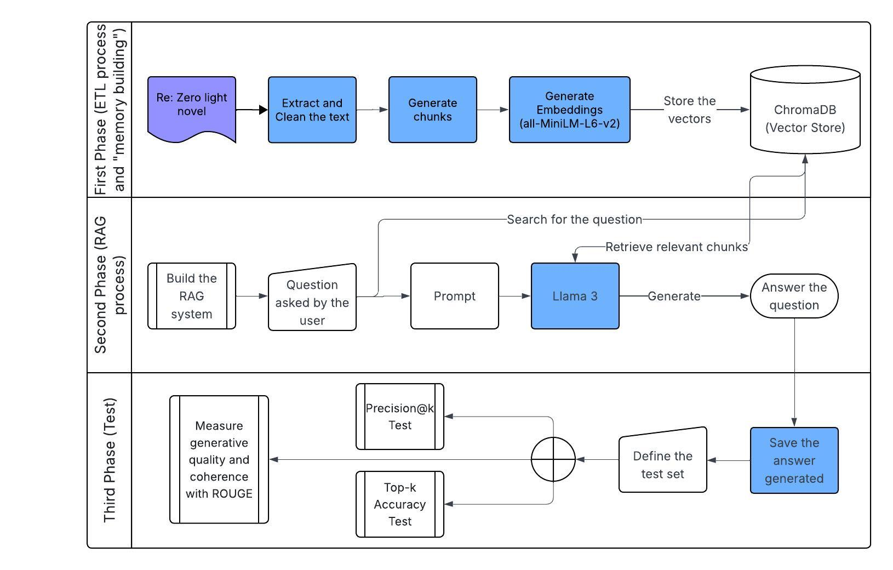

# Narrative Memory AI — Re:Zero Project (Work in Progress): Building an Episodic Memory Retrieval Prototype

## Project definition

This project aims to develop an episodic memory system for language-based agents, using structured narrative as the experimental framework.
Specifically, it focuses on the first arc of the novel Re:Zero − Starting Life in Another World by Tappei Nagatsuki to evaluate the system’s capacity to facilitate event retrieval, infer narrative relationships, and simulate early forms of memory consolidation.

The current Prototype Project constructs "cognitive retrieval layer" that enables an AI agent to answer queries such as “What did Subaru feel about Rem in Arc n?” by searching within its internal narrative memory rather than relying on external world knowledge.

In addition, the system introduces simplified mechanisms for consolidation (summarization) and outlines future extensions toward forgetting and memory reinforcement. These later processes are mentioned as part of the project’s long-term research outlook, while the current work primarily focuses on establishing a reproducible episodic retrieval pipeline.

### Key concepts
- Episodic Memory
- Semantic Memory
- Embeddings
- RAG (Retrieval-Augmented Generation)
- ROUGE (Recall-Oriented Understudy for Gisting Evaluation)
- NLP (Natural Language Processing)
- Linguistic Data Science

### Project objectives
- Extract and preprocess narrative data from the novel through an ETL (Extract–Transform–Load) pipeline.
- Develop a retrieval framework capable of identifying and reasoning over narrative episodes by implementing a Retrieval-Augmented Generation (RAG) architecture.
- Evaluate system's performance through quantitative and qualitative metrics, focusing on retrieval accuracy and narrative coherence.

### Source of data, limitations and legal
- **Source:** Fan translations available on the "Witch Cult Translations" site (used here for prototyping and research).  
- **Limitation of the project:** The source text lacks explicit speaker tags (it is not always clear who is speaking). Consequently, the pipeline requires a robust "Speaker Identification" mechanism to correctly attribute dialogue to specific characters.
- **Legal note:** The novel text is copyrighted by Tappei Nagatsuki and its licensees. This project will not publicly redistribute the full text. Instead, it will store transformed representations (embeddings, summaries, metadata). Any reuse of verbatim passages will follow fair-use guidelines for research; if the project produces a public demo, we will seek permissions or use short quoted excerpts with attribution, or only expose generated summaries rather than full chapters.

## Future perspectives

### 1. Toward Narrative and Semantic Memory
**Timeline:** After completing the current episodic memory prototype (possible master thesis topic)  
**Goal:** Study how language (narrative framing, labeling, and emotional annotation) transforms episodic memories into more abstract semantic representations, simulating human-like consolidation.

#### Proposed objectives
- Represent narrative events: *who did what, when, where, and why*  
- Build relations between episodes (causal, temporal, emotional)  
- Model memory dynamics: *remembering, forgetting, and prioritizing*  
- Use consolidated memories to generate contextually coherent and emotionally consistent responses  

#### Proposed phases
1. **Entity and Relation Extraction:** Identify characters, objects, places, and events from the narrative  
2. **Temporal and Causal Ordering:** Structure episodes chronologically and infer causal connections  
3. **Emotion Tagging:** Annotate scenes with affective or emotional labels (e.g., joy, guilt, fear)  
4. **Knowledge Graph Construction:** Build a graph-based structure connecting events, entities, and emotions  

#### Expected outcome
- A prototype of **narrative-semantic memory**, where the system not only recalls events but also understands their meaning and emotional context.

### 2. Adaptive Memory Management
**Timeline:** To Be Defined.
**Goal:** Develop mechanisms for dynamically prioritizing information during retrieval and generation.

#### Possible research directions
- Implement reinforcement-based strategies for memory strengthening or decay  
- Explore contextual weighting to decide which memories remain active or are “forgotten”  
- Study how memory compression affects narrative coherence and recall accuracy  

### 3. Long-term vision (*Character-Level Simulation*)
**Timeline:** To Be Defined.
**Goal:** Create interactive agents that emulate the memory and behavior of major characters (*e.g.*, Subaru, Emilia, Rem).  

- Each character’s responses would depend on their internal narrative memory  
- Enable role-play or “what-if” scenarios grounded in the story’s emotional and temporal logic  
- This phase will only proceed if proper rights and ethical approvals are obtained  

## Project flow chart

## Project roadmap

The roadmap consists of next three phases.

### First Phase (ETL process and "memory building")
- Scrape and extract textual content.
- Clean and segment the text into episodes/scenes (chunking).
- Generate embeddings for scenes or episodes and store them in a vector database.

### Second Phase (RAG process)
- Develop the retrieval engine to identify narrative episodes based on vector similarity.

### Third Phase (Test)
- Evaluate retrieval quality using Precision@k and Top-k Accuracy.
- Measure generative quality and coherence with ROUGE and cosine similarity between retrieved and generated text.

### Fourth Phase (Advanced Optimization)
This phase is optional and is scheduled to take place between January and June 2026. The goal is to have a functional prototype of the project ready by January 19, 2026 and a fully optimized version completed before the Erasmus Master in Linguistic Data Science begins. This phase will include the following:

- Integrate a reranking step to test if it improves the precision of the retrieved scenes compared to basic vector search.
- Implement a basic summarization module that attempts to compress older episodes, testing if this improves the context window efficiency.
- Evaluate retrieval quality using using Recall@k.

## Ethics, copyright and reuse
- The novel text is copyrighted. This research will favor transformed representations and summaries for public demos.  
- If a public demo is published, obtain permissions or use limited excerpts with attribution.  
- Follow ethical guidelines for fan content and avoid republishing full chapters.

## Project setup & minimal reproducible demo
- Tools: Python, Jupyter notebooks.  
- Minimal demo: a Jupyter notebook that (1) loads preprocessed episodes, (2) builds embeddings, (3) runs a retrieval+generation pipeline and (4) answers a small set of test questions.

## Author & copyright notice
All original novel content is © Tappei Nagatsuki and rightsholders. This repository contains derived data (embeddings, summaries) and research code only. Any use or redistribution of verbatim text remains subject to the original copyright.

## Sources

UCSF Memory and Aging Center. (n.d.). Memory. https://memory.ucsf.edu/brain-health/memory

IBM. (n.d.). What is retrieval-augmented generation (RAG)? https://www.ibm.com/think/topics/retrieval-augmented-generation

Lewis, P., Perez, E., Piktus, A., Petroni, F., Karpukhin, V., Goyal, N., ... & Kiela, D. (2020). Retrieval-augmented generation for knowledge-intensive NLP tasks. Advances in Neural Information Processing Systems, 33, 9459-9474.

Reimers, N., & Gurevych, I. (2019). Sentence-BERT: Sentence embeddings using Siamese BERT-networks. Proceedings of the 2019 Conference on Empirical Methods in Natural Language Processing and the 9th International Joint Conference on Natural Language Processing (EMNLP-IJCNLP), 3982–3992.

Lin, C. Y. (2004). ROUGE: A package for automatic evaluation of summaries. Text Summarization Branches Out, 74-81.
